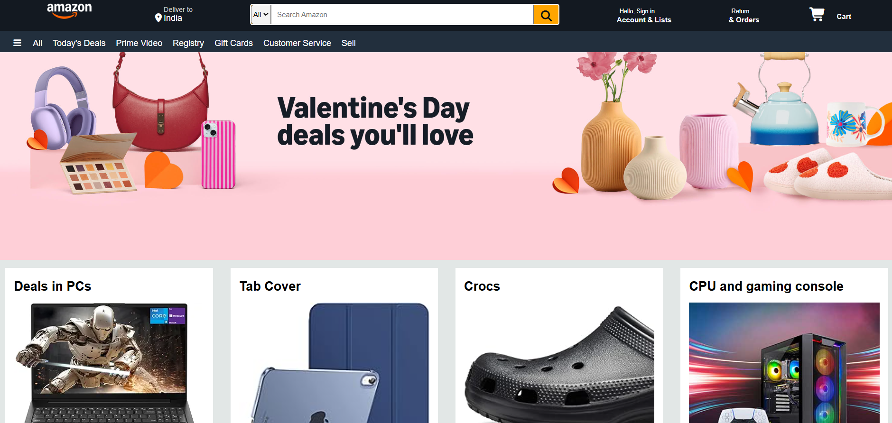
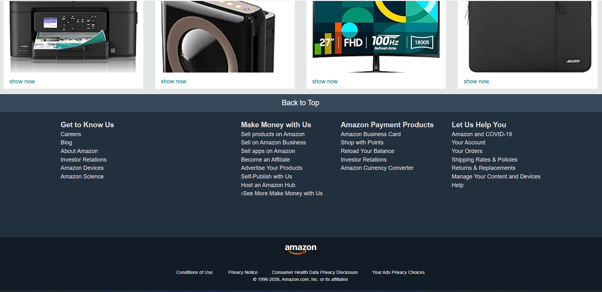

# 🛒 E-Commerce-App_Clone

A responsive **Amazon Clone website** built using **HTML** and **CSS**.  
This project replicates the **UI and layout of Amazon’s homepage**, focusing on clean design, responsiveness, and front-end fundamentals.

---

## 🚀 Features

- 🧭 Amazon-style **navbar with logo, location & search**
- 📦 Product sections with grid-based layout  
- 🖥️ Fully **responsive design** for desktop & mobile  
- 🎨 Clean UI inspired by Amazon’s official design  
- ⚡ Lightweight (pure HTML & CSS, no frameworks)

---

## 🧠 Tech Stack

| Technology | Description |
|------------|------------|
| **HTML5** | Page structure and layout |
| **CSS3** | Styling, Flexbox, Grid, responsiveness |

---

## 🖼️ Preview

---

## 🔗 Live Link

Check out the live version of my Amazon Clone here:  
👉 **[Visit Amazon Clone](https://adityamahekar.github.io/Simple_Protfolio/)**

---

## 📌 Note

This project is created **only for learning and practice purposes**.  
All design inspiration belongs to **Amazon**.
